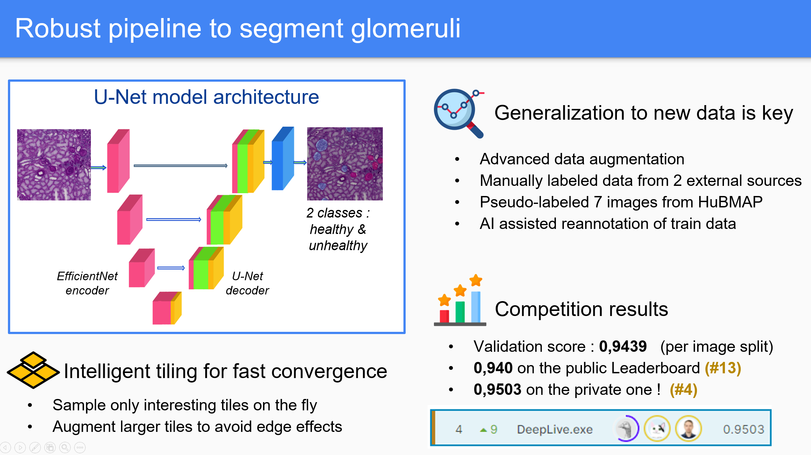

# 4th place solution to the HuBMAP - Hacking the Kidney Kaggle Competition
#### Authors : [@theoviel](https://github.com/theoviel), [@optimox](https://github.com/Optimox), [@iafoss](https://github.com/iafoss)

#### Status :
- Document code : Done
- Clean notebooks : Done
- Make ReadMe : Almost Done
- Add the code for individual differences : WIP
- Clean code for glomeruli level metrics : WIP


## Introduction

Our approach is built on understanding the challenges behind the data. Our main contribution is the consideration of the link between healthy glomeruli and unhealthy ones by predicting both into two different classes. We incorporate several external datasets in our pipeline and manually annotated the two classes.
Our model architecture is relatively simple, and the pipeline can be easily transferred to other tasks.

You can read more about our solution [here](https://www.kaggle.com/theoviel/hubmap-final-methodology-submission/). A more concise write-up is also available [here](https://www.kaggle.com/c/hubmap-kidney-segmentation/discussion/238024).

The `main` branch contains a cleaned and simplified version of our pipeline, that is enough to reproduce our solution.


## Overview



Our pipeline achieves highly competitive performance on the task, because of the following aspects :
- It allows for fast experimenting and results interpretation:
  - Pre-computation of resized images and masks of the desired size for short dataset preparation times
  - Uses half-precision for faster training
  - Interactive visualization of predicted masks in notebooks
  - Glomeruli level metrics and confidence to understand the flaws of the model [TODO : Add code]
- It uses intelligent tiling, compatible with every segmentation task on big images.
  - We sample only interesting regions, using mask and tissue information
  - Tiling is made on the fly, on previously resized images for efficiency.
  - Augmentations are made on slightly bigger tiles to get rid of side effects
- It is adapted to the specificity of the problem, to better tackle its complexity :
  - We added another class to the problem : unhealthy glomeruli
  - We manually annotated external data, as well as missing masks in the training data using model feedback.
  - Aggressive augmentations help the model generalize well to quality issues in the test data


For the following reasons, our code is convenient to use, especially for researchers :
- It is only based on commonly used and reliable libraries:
  - [PyTorch](https://pytorch.org/)
  - [Albumentations](https://albumentations.ai/) for augmentations
  - [Segmentations Models PyTorch](https://github.com/qubvel/segmentation_models.pytorch) for modeling
- It is easily re-usable:
  - It is documented and formatted 
  - It includes best-practices from top Kagglers, who also have experience in research and in the industry
  - It is (relatively) low level, which means one can independently use each brick of our pipeline in their code
  - We applied our pipeline to keratinocytes segmentation in LC-OCT and quickly achieved good results. See [here](https://www.kaggle.com/theoviel/hubmap-final-methodology-submission/) for more information.


## How to use the repository

- Clone the repository
- [TODO : Requirements]

- Download the data :
  - Put the competition data from [Kaggle](https://www.kaggle.com/c/hubmap-kidney-segmentation/data) in the `input` folder
  - Put the extra `Dataset A` images from [data.mendeley.com](https://data.mendeley.com/datasets/k7nvtgn2x6/3) in the `input/extra/` folder.
  - Put the [two additional images from the HubMAP portal](https://www.kaggle.com/iafoss/hubmap-ex) in the `input/test/` folder.
  - You can download pseudo labels [on Kaggle](https://www.kaggle.com/theoviel/hubmap-pl/)
  - We also provide our trained model weights [on Kaggle](https://www.kaggle.com/theoviel/hubmap-cp/)

- Prepare the data :
  - Extract the hand labels using `notebooks/Json to Mask.ipynb` :
    - Use the `ADD_FC` and `ONLY_FC` parameters to generate labels for the healthy and unhealthy classes.
    - Use the `SAVE_TIFF `parameter to save the external data as tiff files of half resolution.
    - Use the `PLOT` parameter to visualize the masks.
    - Use the `SAVE` parameter to save the masks as rle.
  - Create lower resolution masks and images using `notebooks/Image downscaling.ipynb` :
    - Use the `FACTOR` parameter to specify the downscaling factor. We recommend generating data of downscaling 2 and 4.
    - For training data, we save extra time by also computing downscaling rles. Use the `NAME` parameter to specify which rle to downscale. Make sure to run the script for all the dataframes you want to use.
    - It is only require to save the downscaled images once, use the `SAVE_IMG` parameters to this extent.
  - The process is a bit time-consuming, but only requires to be done once. This allows for faster experimenting : loading and downscaling the images when building the dataset takes a while, so we don't want to do it every time. 

- Train models using `notebooks/Training.ipynb`
  - Use the `DEBUG` parameter to launch the code in debug mode (single fold, no logging)
  - Specify the training parameters in the `Config` class. Feel free to experiment with the parameters, here are the main ones :
    - `tile_size` : Tile size
    - `reduce_factor` : Downscaling factor
    - `on_spot_sampling` : Probability to accept a random tile with in the dataset
    - `overlap_factor` : Tile overlapping during inference
    - `selected_folds` : Folds to run computations for.
    - `encoder` : Encoder as defined in [Segmentation Models PyTorch](https://github.com/qubvel/segmentation_models.pytorch)
    - `decoder` : Decoders from [Segmentation Models PyTorch](https://github.com/qubvel/segmentation_models.pytorch)
    - `num_classes` : Number of classes. Keep it at 2 to use the healthy and unhealthy classes
    - `loss` : Loss function. We use the BCE but the lovasz is also interesting
    - `optimizer` : Optimizer name
    - `batch_size` : Training batch size, adapt the `BATCH_SIZES` dictionary to your gpu
    - `val_bs` : Validation batch size
    - `epochs` : Number of training epochs
    - `iter_per_epoch` : Number of tiles to use per epoch
    - `lr` : Learning rate. Will be decayed linearly
    - `warmup_prop` : Proportion of steps to use for learning rate warmup
    - `mix_proba` : Probability to apply MixUp with
    - `mix_alpha` : Alpha parameter for MixUp
    - `use_pl`: Probability to sample a tile from the pseudo-labeled images
    - `use_external`: Probability to sample a tile from the external images
    - `pl_path`: Path to pseudo labels generated by `notebooks/Inference_test.ipynb`
    - `extra_path` : Path to extra labels generated by `notebooks/Json to Mask.ipynb` (should not be changed)
    - `rle_path` : Path to train labels downscaled by `notebooks/Image downscaling.ipynb`  (should not be changed)

- Validate models with `notebooks/Inference.ipynb` :
  - Use the `log_folder` parameter to specify the experiment.
  - Use the `use_tta` parameter to specify whether to use test time augmentations.
  - Use the `save` parameter to indicate whether to save predictions.
  - Use the `save_all_tta` parameter to save predictions for each tta (takes a lot of disk space).
  - Use the `global_threshold` parameter to tweak the threshold.

- Generate pseudo-labels  with `notebooks/Inference Test.ipynb` :
  - Use the `log_folder` parameter to specify the experiment.
  - Use the `use_tta` parameter to speciy whether to use test time augmentations.
  - Use the `save` parameter to indicate whether to save predictions.

- Visualize predictions : `notebooks/Visualize Predictions.ipynb`
  - Works to visualize predictions from the two previous notebooks, but also from a submission file.
  - Specify the `name`, `log_folder` and `sub` parameters according to what you want to plot.


## Code structure

If you wish to dive into the code, the repository naming should be straight-forward. Each function is documented.
The structure is the following :

```
code
├── data
│   ├── dataset.py      # Torch datasets
│   └── transforms.py   # Augmentations
├── inference 
│   ├── main_test.py    #  Inference for the test data
│   └── main.py         # Inference for the train data
├── model_zoo 
│   └── models.py       # Model definition
├── training 
│   ├── lovasz.py       # Lovasz loss implementation
│   ├── main.py         # k-fold and training main functions
│   ├── meter.py        # Meter for evaluation during training
│   ├── mix.py          # CutMix and MixUp
│   ├── optim.py        # Losses and optimizer handling
│   ├── predict.py      # Functions for prediction
│   └── train.py        # Fitting a model
├── utils 
│   ├── logger.py       # Logging utils
│   ├── metrics.py      # Metrics for the competition
│   ├── plots.py        # Plotting utils
│   ├── rle.py          # RLE encoding utils
│   └── torch.py        # Torch utils
└── params.py           # Main parameters
``` 
